# List of MicroSims for Measuring GenAI ROI

Interactive Micro Simulations to help students learn measuring genai roi fundamentals.

-   **[Alert Threshold Tuner](./alert-threshold-tuner/index.md)**

    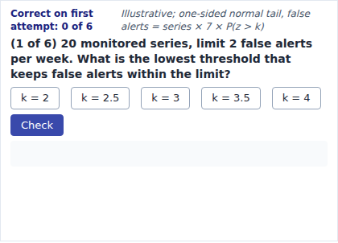

    The learner will recommend, for each of six monitoring scenarios, the smallest threshold multiplier from 2, 2.5, 3, 3.5, and 4 standard deviations that keeps the expected false alerts per week at or below the stated limit.

-   **[Anatomy of a Prompt](./prompt-anatomy-explorer/index.md)**

    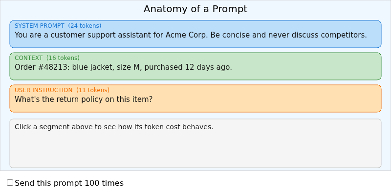

    Interactive p5.js MicroSim for anatomy of a prompt.

-   **[Autoscaling and Warm Pool Behavior Over a Traffic Day](./autoscaling-traffic-simulator/index.md)**

    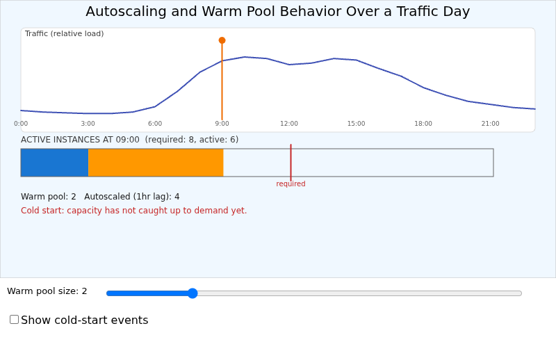

    Interactive p5.js MicroSim for autoscaling and warm pool behavior over a traffic day.

-   **[Benefit Realization Calculator](./benefit-realization-calculator/index.md)**

    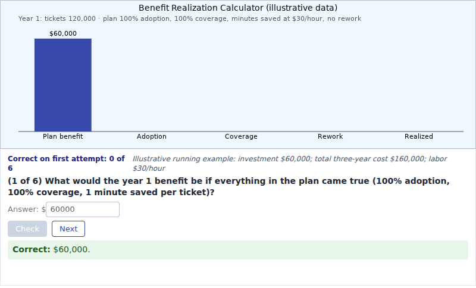

    The learner will calculate the year 1 realized benefit and the three-year ROI of the running example from measured adoption, usage coverage, minutes saved, and rework data, to within $1 for dollar values and 0.1 percentage points for ROI.

-   **[Budget Burn Alert Simulator](./budget-burn-alert-simulator/index.md)**

    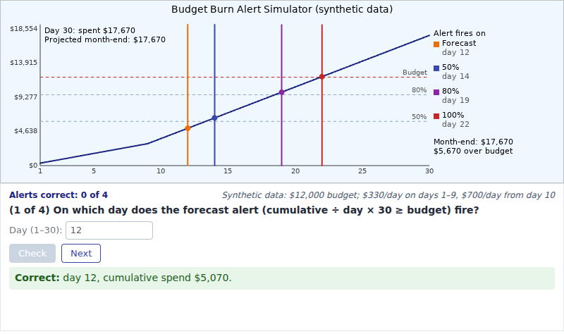

    The learner will calculate the day on which each of four cost alerts (50%, 80%, 100% of budget, and month-end forecast) fires for a month with a runaway daily spend, to the exact day.

-   **[Byte Pair Encoding Step-Through](./bpe-tokenizer-explorer/index.md)**

    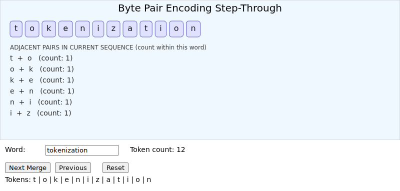

    Interactive p5.js MicroSim for byte pair encoding step-through.

-   **[Compute Utilization and Idle Cost Explorer](./compute-utilization-explorer/index.md)**

    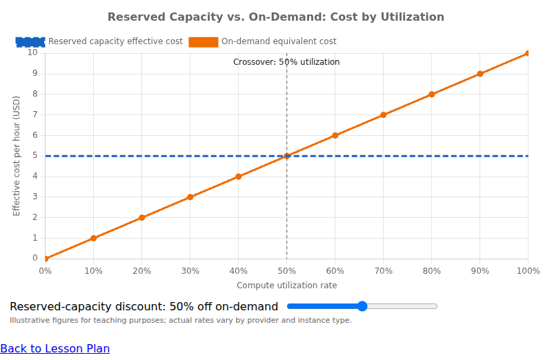

    Interactive Chart.js MicroSim for compute utilization and idle cost explorer.

-   **[Confusion Matrix Metric Explorer](./confusion-matrix-metric-explorer/index.md)**

    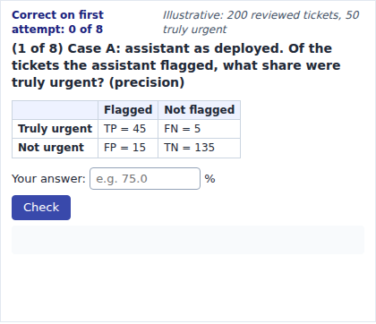

    The learner will calculate precision, recall, and accuracy from the four counts of a confusion matrix for eight prompted cases, to within 0.5 percentage points.

-   **[Context Window Budget Allocation](./context-window-budget-chart/index.md)**

    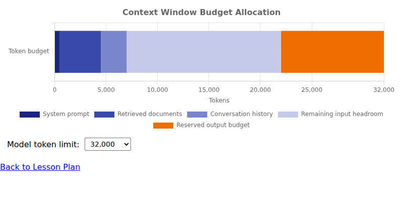

    Interactive Chart.js MicroSim for context window budget allocation.

-   **[Control Group Attribution Lab](./control-group-attribution-lab/index.md)**

    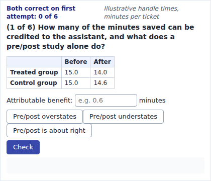

    The learner will attribute the measured change in ticket handle time to the assistant for each of six scenarios by subtracting the control group's change, and will identify whether a pre/post study alone overstates, understates, or about equals the attributable benefit.

-   **[Cost Concept Classifier](./cost-concept-classifier/index.md)**

    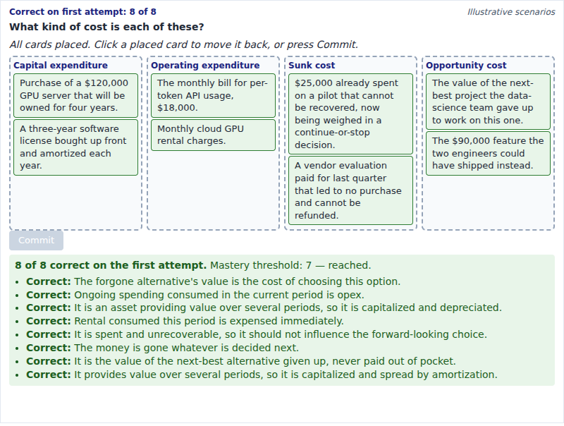

    The learner will classify each of eight spending descriptions as capital expenditure, operating expenditure, sunk cost, or opportunity cost.

-   **[Cost Metric Lineage Explorer](./cost-metric-lineage-explorer/index.md)**

    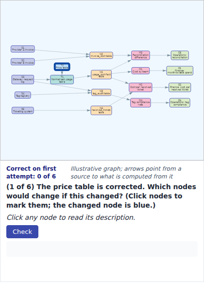

    The learner will examine a 19-node lineage graph to identify every downstream node affected when one source, table, or metric changes, for six change scenarios, matching the affected set exactly.

-   **[Cost Per Task Benchmark Explorer](./cost-per-task-benchmark-explorer/index.md)**

    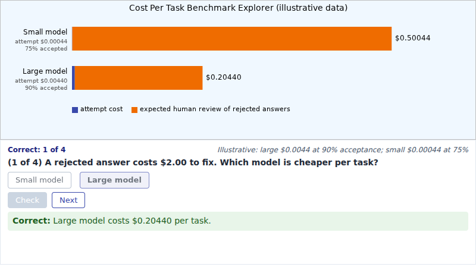

    The learner will compare the cost per completed task of a small and a large model, including human review of rejected answers, and identify which is cheaper at four review costs.

-   **[Cross-Provider Token Efficiency Dashboard](./token-efficiency-dashboard/index.md)**

    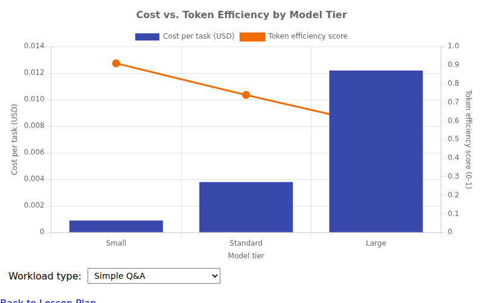

    Interactive Chart.js MicroSim for cross-provider token efficiency dashboard.

-   **[Deployment Placement Sorter](./deployment-placement-sorter/index.md)**

    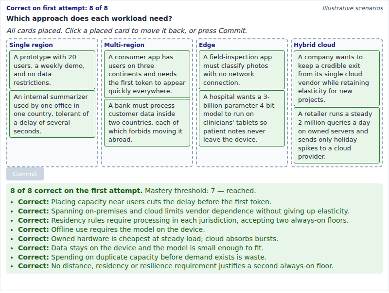

    The learner will distinguish which of four placement approaches (single region, multi-region, edge, hybrid cloud) best fits each of eight workload descriptions, by matching the deciding requirement in each description.

-   **[Developer Productivity Index Builder](./developer-productivity-index-builder/index.md)**

    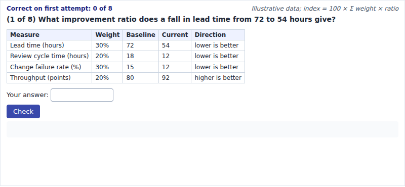

    The learner will calculate four improvement ratios and the weighted developer productivity index for the 20-engineer team, to within 0.01 for ratios and 0.1 for index points.

-   **[Fixed Versus Variable Break-Even Calculator](./break-even-calculator/index.md)**

    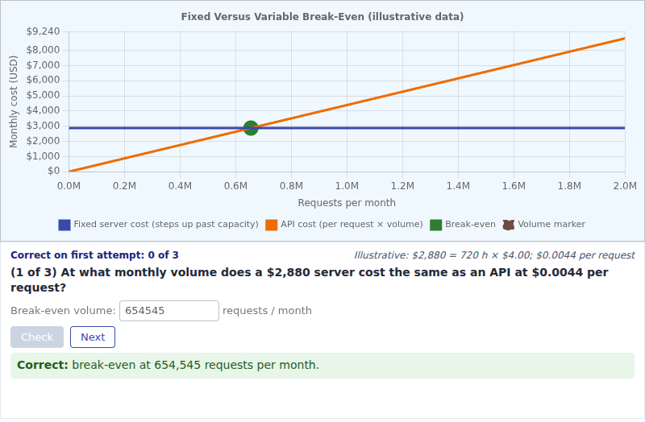

    The learner will calculate the monthly request volume at which a fixed-cost server and a per-request API cost the same, to within 1,000 requests.

-   **[From Raw Text to Helpful Assistant](./training-lifecycle-workflow/index.md)**

    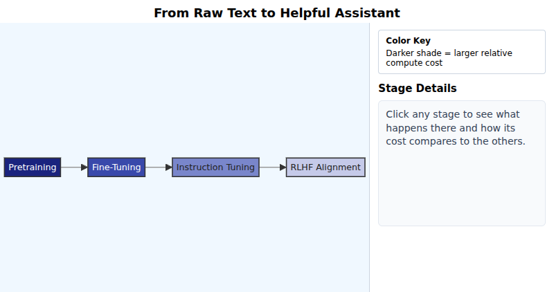

    Interactive Mermaid MicroSim for from raw text to helpful assistant.

-   **[Labeling Strategy Cost Calculator](./labeling-strategy-cost-calculator/index.md)**

    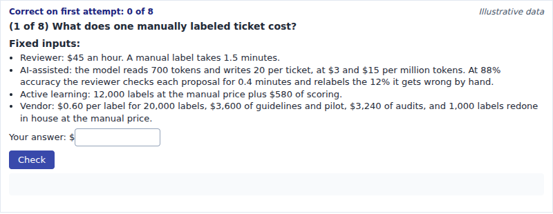

    The learner will calculate the cost of labeling 20,000 tickets by manual labeling, AI-assisted labeling, active learning, and an outside vendor, to within the tolerance stated for each item.

-   **[Metric Matcher](./metric-matcher/index.md)**

    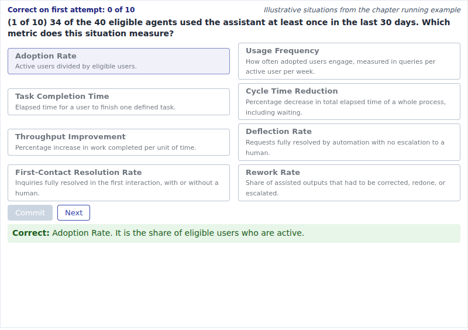

    The learner will classify each of ten described situations under the one metric from a list of eight that the situation measures, with at least 8 of 10 correct on the first attempt.

-   **[Model Cascade Cost Calculator](./model-cascade-cost-calculator/index.md)**

    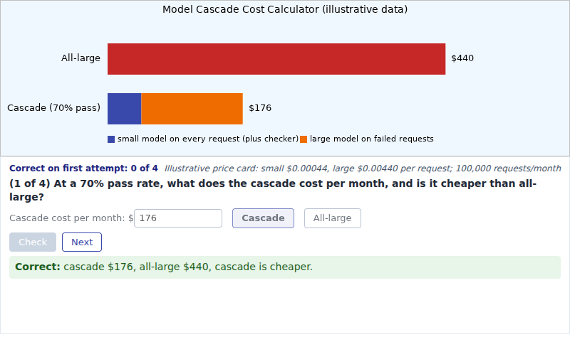

    The learner will calculate the monthly cost of a small-model-first cascade for a stated pass rate and decide whether it is cheaper than sending every request to the large model.

-   **[Model Scale Across Five Years](./model-parameter-scale-chart/index.md)**

    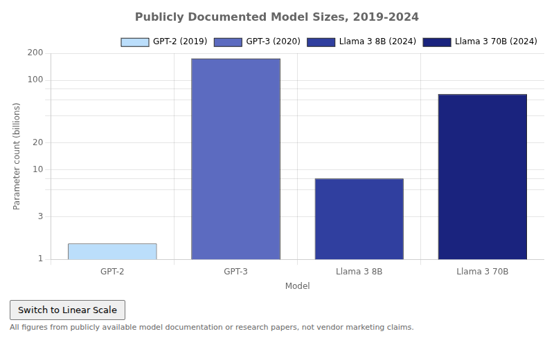

    Interactive Chart.js MicroSim for model scale across five years.

-   **[Multi-Tenant Cost Allocator](./multi-tenant-cost-allocator/index.md)**

    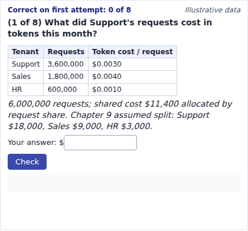

    The learner will calculate each tenant's direct token cost, shared-cost allocation, and total allocated cost for the shared platform from request counts and per-request costs, to within $1.

-   **[NPV and Payback Calculator](./npv-payback-calculator/index.md)**

    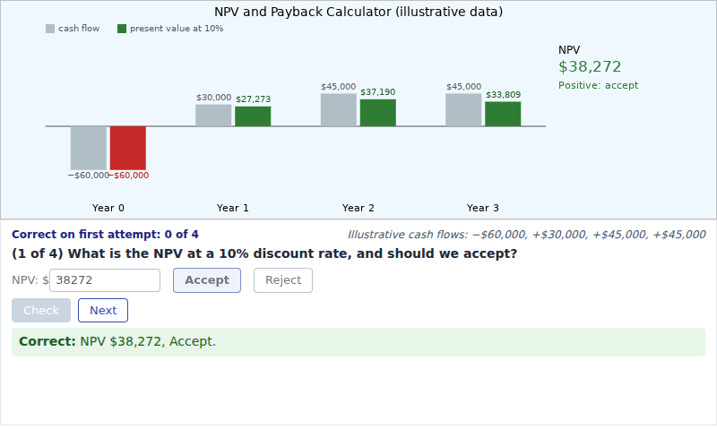

    The learner will calculate the net present value of the running-example cash flows at a stated discount rate to within $5, and decide whether the investment should be accepted.

-   **[One-Time Training vs. Recurring Inference](./training-vs-inference-cost-chart/index.md)**

    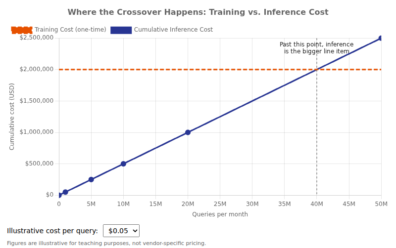

    Interactive Chart.js MicroSim for one-time training vs. recurring inference.

-   **[Peak Capacity Planner](./peak-capacity-planner/index.md)**

    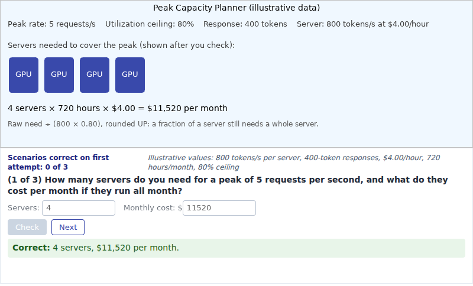

    The learner will calculate the number of inference servers needed for a stated peak request rate and utilization ceiling, and the monthly cost of provisioning for the peak around the clock, to the nearest whole server and dollar.

-   **[Per-Request Token Cost Calculator](./token-cost-calculator/index.md)**

    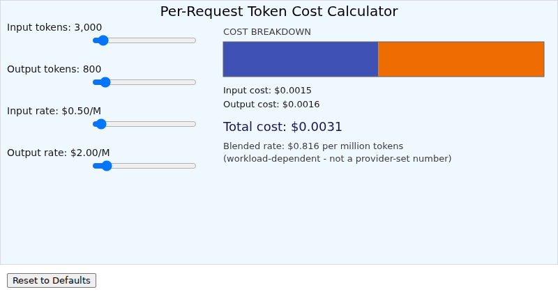

    Interactive p5.js MicroSim for per-request token cost calculator.

-   **[Pipeline Stage Sorter](./pipeline-stage-sorter/index.md)**

    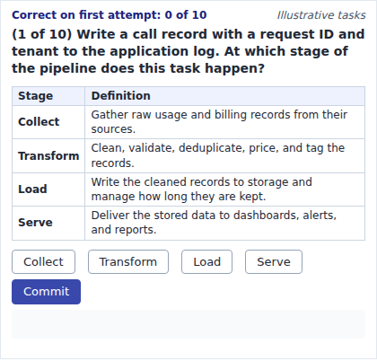

    The learner will classify each of ten cost-analytics pipeline tasks under the one of four stages (Collect, Transform, Load, Serve) in which it occurs, with at least 8 of 10 correct on the first attempt.

-   **[Prompt A/B Test Decision Lab](./prompt-ab-test-decision-lab/index.md)**

    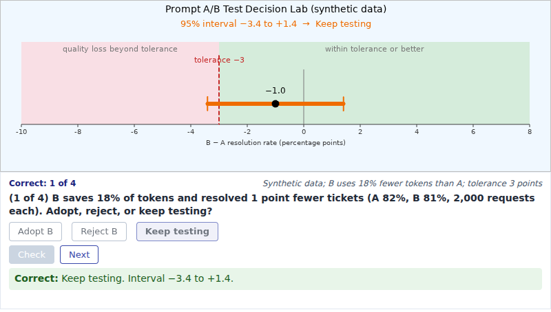

    The learner will judge, from a 95% interval for the quality difference, whether to adopt, reject, or keep testing a shorter prompt variant against a 3-point quality tolerance.

-   **[Prompt Compression Before/After Comparator](./prompt-compression-comparator/index.md)**

    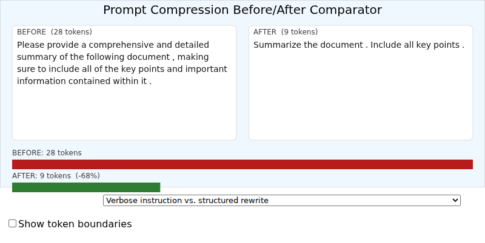

    Interactive p5.js MicroSim for prompt compression before/after comparator.

-   **[Request Routing Flow](./request-routing-flow/index.md)**

    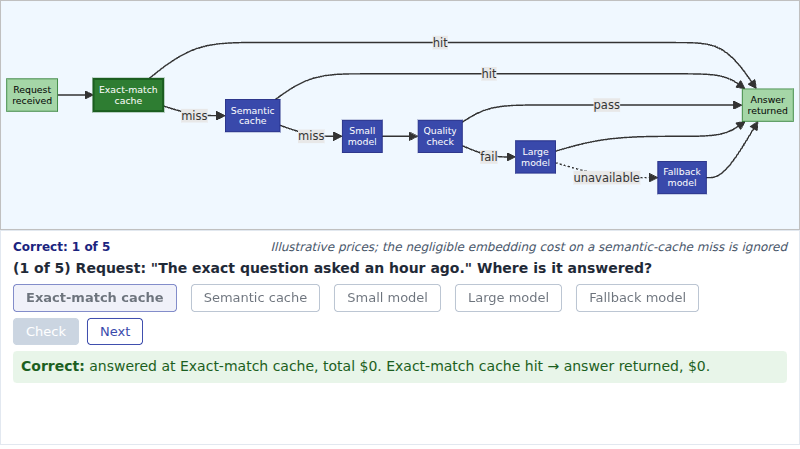

    The learner will explain which path through cache, small model, quality check, large model, and fallback model each of five example requests takes and what it costs.

-   **[Retraining Cadence Tuner](./retraining-cadence-tuner/index.md)**

    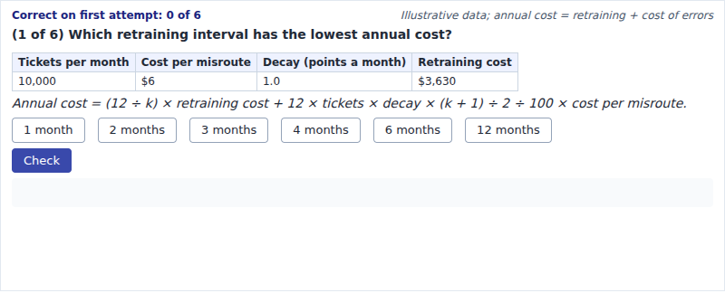

    The learner will recommend, for each of six scenarios, the retraining interval of 1, 2, 3, 4, 6, or 12 months that has the lowest annual cost.

-   **[Retraining Trigger Classifier](./retraining-trigger-classifier/index.md)**

    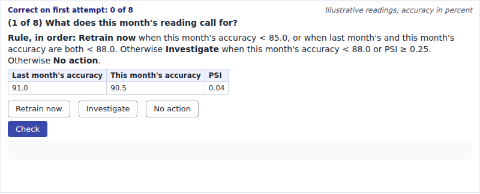

    The learner will differentiate eight monthly monitoring readings that call for retraining, investigation, or no action by applying the team's retraining trigger rule.

-   **[Roadmap Prioritizer](./roadmap-prioritizer/index.md)**

    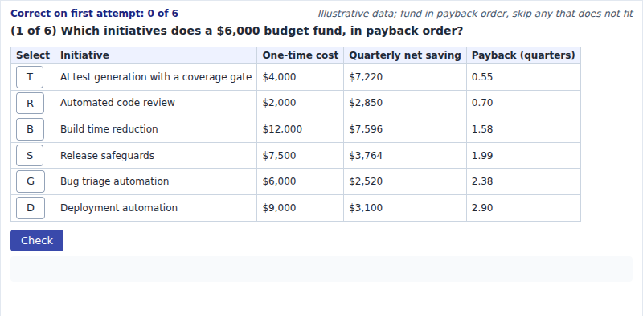

    The learner will prioritize six SDLC initiatives for each of six one-time budgets by selecting the set that the rule "fund in payback order, skipping any initiative that does not fit the remaining budget" produces.

-   **[Roll-Up and Reconciliation Calculator](./rollup-reconciliation-calculator/index.md)**

    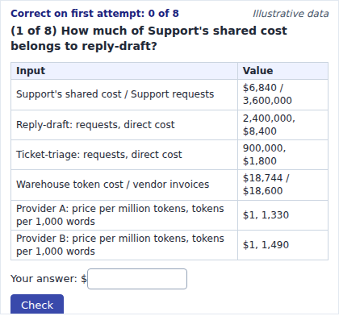

    The learner will calculate a feature's allocated shared cost and unit cost, the reconciliation difference between warehouse and invoices, and a normalized cost per million words for two providers, to the tolerances stated for each item.

-   **[Same Task, Three Prompting Strategies](./prompting-technique-comparator/index.md)**

    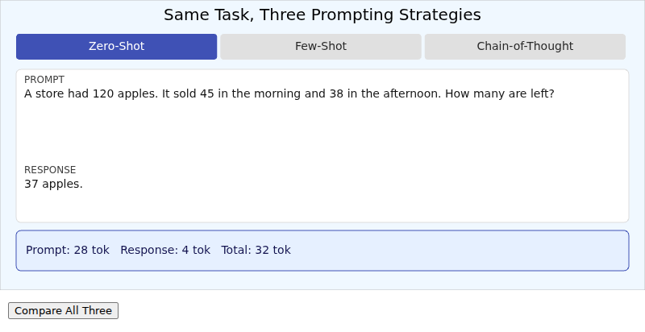

    Interactive p5.js MicroSim for same task, three prompting strategies.

-   **[SDLC Phase Savings Calculator](./sdlc-phase-savings-calculator/index.md)**

    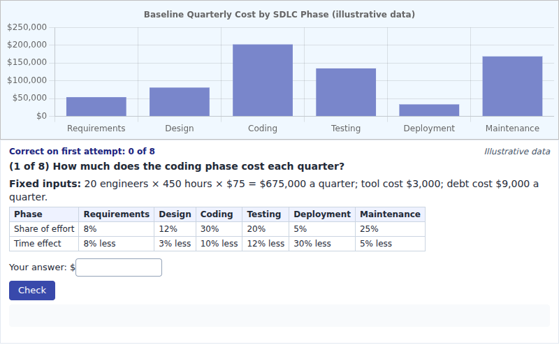

    The learner will calculate the quarterly cost of an SDLC phase, the time value freed in it, and the total gross and net time value across six phases for the 20-engineer team, to within $1.

-   **[SDLC ROI Case Study Workbench](./sdlc-roi-case-study-workbench/index.md)**

    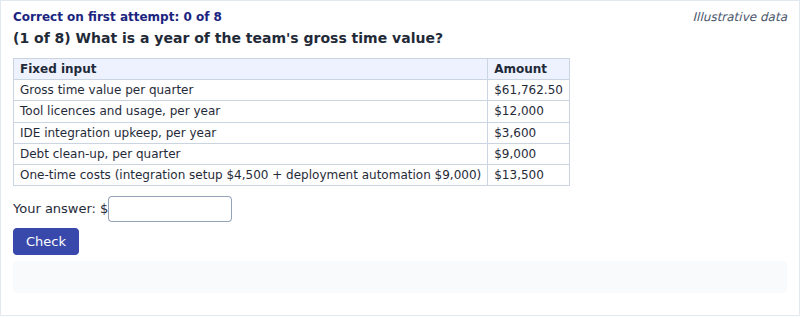

    The learner will calculate the year 1 costs, benefit, net, ROI, and break-even realization of the 20-engineer SDLC case, to within $1 for dollar values and 0.1 percentage points for percentages.

-   **[Self-Attention, Qualitatively](./self-attention-explorer/index.md)**

    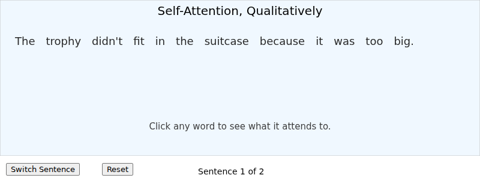

    Interactive p5.js MicroSim for self-attention, qualitatively.

-   **[Semantic Cache Threshold Explorer](./semantic-cache-threshold-explorer/index.md)**

    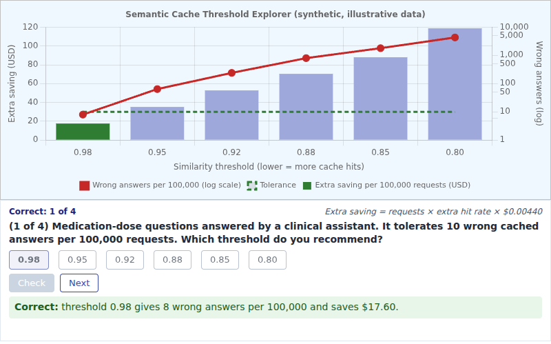

    The learner will recommend the similarity threshold that gives the largest saving without exceeding a stated tolerance for wrong cached answers per 100,000 requests.

-   **[Sensitivity Tornado Ranker](./sensitivity-tornado-ranker/index.md)**

    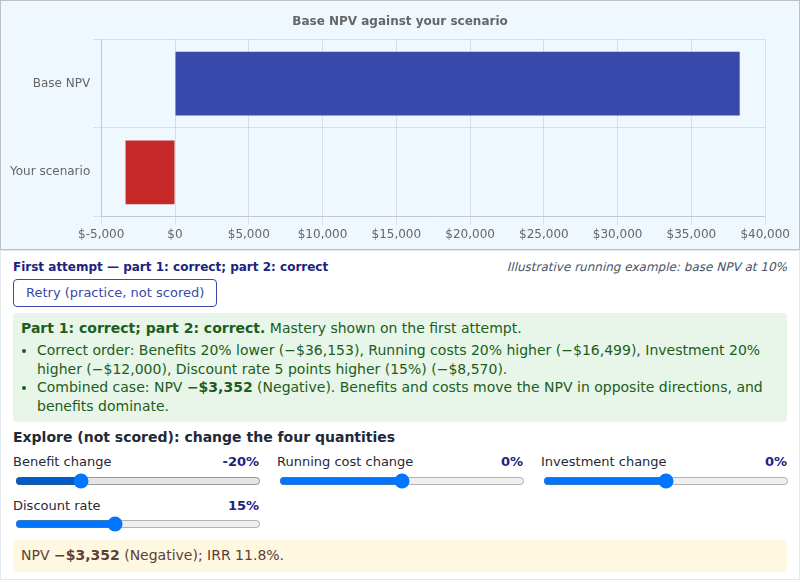

    The learner will differentiate which of four input changes reduces the running-example NPV the most, by ranking them from most to least damaging, and will predict whether a combined change makes the NPV negative.

-   **[Serving Batch Size Tuner](./serving-batch-tuner/index.md)**

    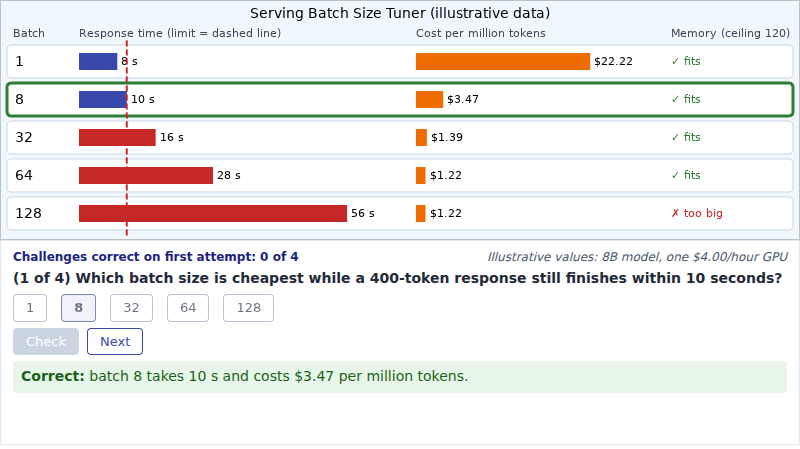

    The learner will solve for the batch size that gives the lowest cost per million tokens while a 400-token response finishes within a stated latency limit and the batch fits in GPU memory.

-   **[Shift-Left Investment Judge](./shift-left-investment-judge/index.md)**

    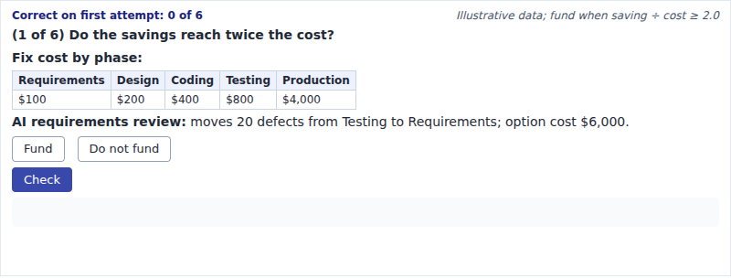

    The learner will judge, for each of six AI investment options, whether to fund it using the rule that savings from moving defects to an earlier phase must be at least twice the cost.

-   **[Significance Check Lab](./significance-check-lab/index.md)**

    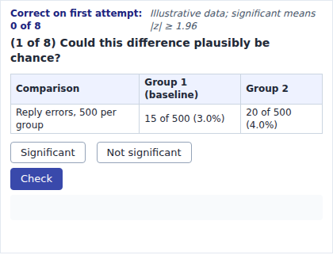

    The learner will judge, for each of eight comparisons of two rates, whether the difference is statistically significant at the 5% level using the rule that the absolute value of z must be at least 1.96.

-   **[Speed Versus Quality Check](./speed-versus-quality-check/index.md)**

    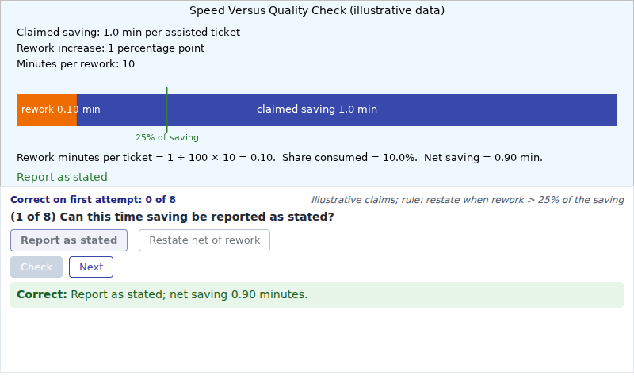

    The learner will judge, for each of eight time-saving claims, whether the claim can be reported as stated or must be restated net of rework, using the rule that rework minutes above 25% of the claimed saving require restatement.

-   **[Spend Anomaly Detector](./spend-anomaly-detector/index.md)**

    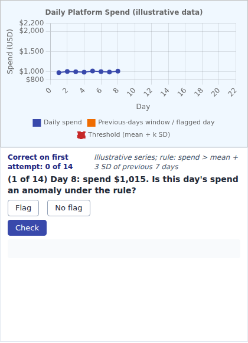

    The learner will distinguish, for each of 14 days of platform spend, the days flagged by the rule "spend greater than the mean plus 3 standard deviations of the previous 7 days" from the days not flagged, and will identify the day on which masking hides a real spike.

-   **[Technical Debt Break-Even Explorer](./technical-debt-break-even-explorer/index.md)**

    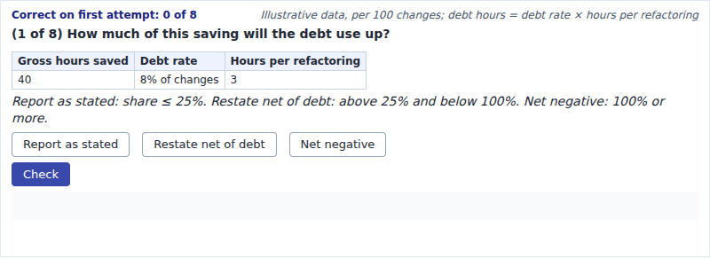

    The learner will assess, for each of eight scenarios, whether an AI saving can be reported as stated, must be restated net of debt, or is net negative, using thresholds on the share of the gross saving that the debt consumes.

-   **[The AI Family Tree](./ai-family-tree/index.md)**

    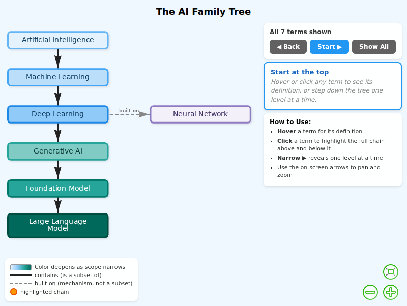

    An interactive vis-network diagram showing how Artificial Intelligence, Machine Learning, Deep Learning, Neural Networks, Generative AI, Foundation Models, and Large Language Models nest inside one another.

-   **[The Batch-Size Trade-Off](./latency-throughput-tradeoff-chart/index.md)**

    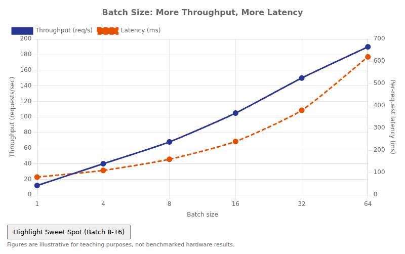

    Interactive Chart.js MicroSim for the batch-size trade-off.

-   **[The GenAI Deployment Landscape](./model-deployment-landscape/index.md)**

    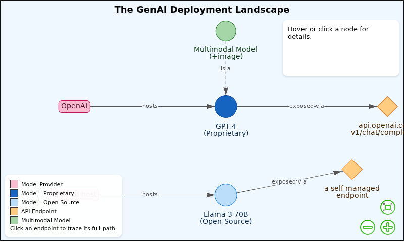

    Interactive vis-network MicroSim for the genai deployment landscape.

-   **[The RAG Pipeline](./rag-pipeline-workflow/index.md)**

    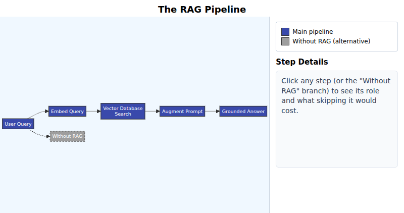

    Interactive Mermaid MicroSim for the rag pipeline.

-   **[Three Ways to Shrink a Model](./model-compression-tradeoffs-chart/index.md)**

    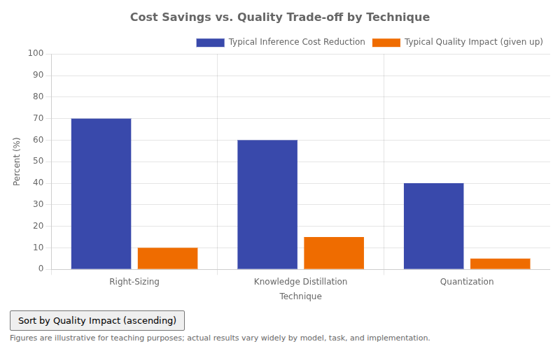

    Interactive Chart.js MicroSim for three ways to shrink a model.

-   **[Token Budget Governance Workflow](./token-budget-governance-workflow/index.md)**

    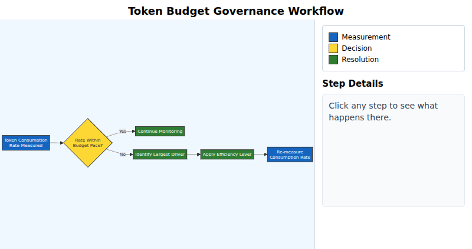

    Interactive Mermaid MicroSim for token budget governance workflow.

-   **[Unit Cost Metrics Calculator](./unit-cost-metrics-calculator/index.md)**

    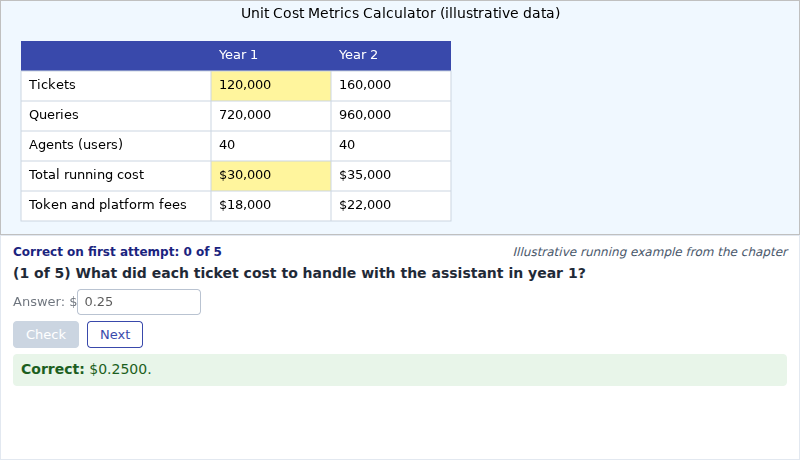

    The learner will calculate cost per transaction, cost per query, and cost per user from the running example's operating data, distinguishing fully loaded cost from fees only.

-   **[Where Should This Model Run?](./deployment-model-landscape/index.md)**

    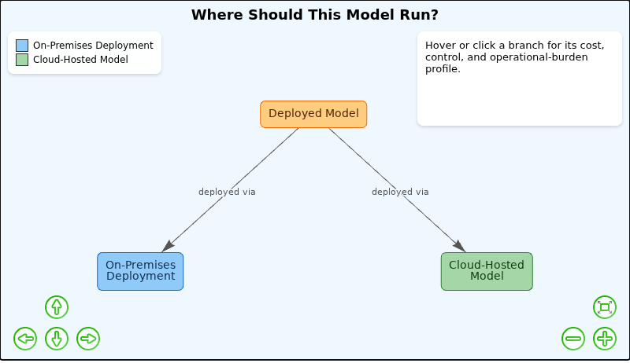

    Interactive vis-network MicroSim for where should this model run?.

